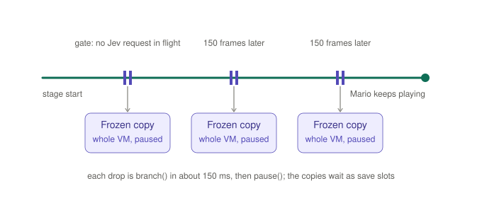
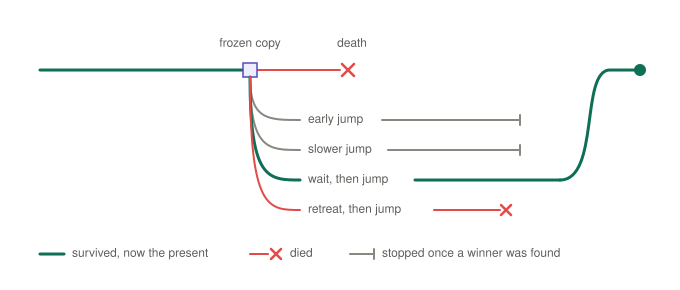
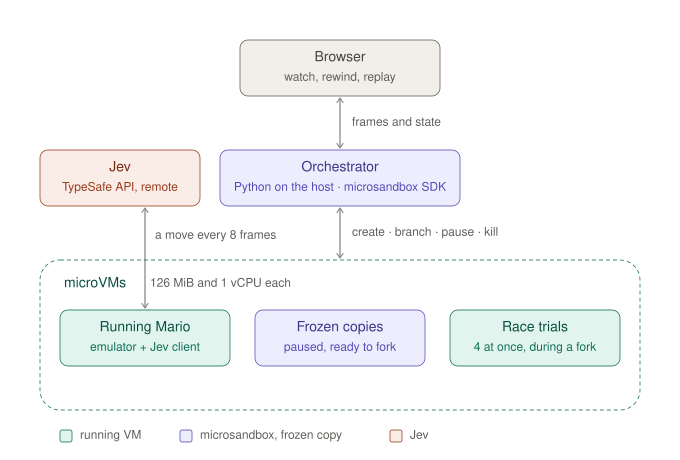
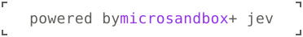

# Mario Never Dies

<p align="center">
  
</p>

**What if game over was just a fork in the road?**

What if Mario could try another future every time he died? In this demo, **Jev chooses its moves** while [microsandbox](https://github.com/superradcompany/microsandbox) periodically **freezes a copy of the entire running machine**. Every time Mario dies, microsandbox splits the last checkpoint into **four VM copies**. Each is a verse that tries a different approach, and **the one that makes it becomes canon**.

You can watch it unfold in your browser, with the game alongside **a map of its branching timelines**.

## Run it

Needs Python 3.13+, uv, and a microsandbox-supported host. Export `TYPESAFE_API_KEY`, or point `--env-file` at a file that sets it.

```sh
uv run mnd
```

## How it works

### Checkpoint: keep a frozen copy

Every 150 game frames, microsandbox **snapshots the entire VM running Mario**, keeping a frozen copy as a **checkpoint** and letting the original VM continue playing. If Mario dies later, the frozen copy provides a place to try again.

<p align="center">
  <picture>
    <source media="(prefers-color-scheme: dark)" srcset="diagrams/gate-dark.svg">
    
  </picture>
</p>

The copy is the whole machine: the emulator process, the game's RAM, the Python state and the filesystem. It is not a screenshot or a save file.

### Death: split into four verses

When Mario dies, the dead VM is thrown away, and the last frozen copy far enough before the death is branched four ways at once.

<p align="center">
  <picture>
    <source media="(prefers-color-scheme: dark)" srcset="diagrams/race-dark.svg">
    
  </picture>
</p>

Each verse opens with a different scripted recovery (an earlier jump, a slower one, a wait, a retreat) of at most 80 frames, then hands the controller back to Jev. The first verse seen alive past the hazard becomes canon, the run from then on, and the others collapse. If none makes it, the copy is split again with sequences it has not tried, and after that the copy before it.

## System overview

<p align="center">
  <picture>
    <source media="(prefers-color-scheme: dark)" srcset="diagrams/system-dark.svg">
    
  </picture>
</p>

| | |
| --- | --- |
| Each VM | 126 MiB of RAM, 1 vCPU, and a 4 GiB sparse disk |
| Inside a VM | The NES emulator, the game loop, a RAM parser and the Jev client |
| Jev | TypeSafe's remote API, asked for a move every 8 game frames |
| Host | A Python orchestrator on the [microsandbox SDK](https://github.com/superradcompany/microsandbox), and a local web server |
| Browser | Plain HTML, CSS and JS |
| Frozen copies | Up to 12 paused VMs per stage |
| A split | 4 running VMs branched from one frozen copy. Each is a verse, numbered for the whole run |
| Canon | The verse that survives a split and becomes the run |
| Stages | 1-1 → 1-2 → 1-3 → 1-4, a fresh VM for each |

## Jev decision details

Every decision is one API call: **structured game state in, three typed answers out.** Jev never sees a screenshot, raw RAM, or a chat history, only what the parser read out of the emulator's memory that frame.

```python
client.system_one(
    state=game_state,
    questions={
        "next_action": Choice(...),  # which move to hold for the next 8 frames
        "jump_needed": Noul(...),    # does the terrain or an enemy call for a jump now?
        "danger": Score(...),        # how dangerous is this moment?
    },
)
```

Only `next_action` drives the controller. The other two are logged next to the move's probabilities and confidence.

The state describes Mario, what is around him, and what just happened. Abbreviated, from a recorded 1-1 decision:

```json
{
  "level": {"world": 1, "stage": 1},
  "player": {
    "x": 117,
    "y": 79,
    "horizontal_speed_px_per_frame": 3,
    "grounded": true,
    "jump_phase": "grounded"
  },
  "hazard": {
    "enemy_ahead": false,
    "jump_must_start_this_decision": false
  },
  "terrain": {
    "obstacle_ahead": false,
    "gap_ahead": false,
    "clear_forward_tiles": 8
  },
  "recent_control": {
    "action": "right_run",
    "outcome": "advanced"
  }
}
```

The full state adds a small tile map of the terrain ahead (`#` terrain, `P` pipe, `o` coin, `?` question block, `u` offscreen), enemy positions with projected contact timing, the jump trajectory, the landing platforms visible across a gap, and up to four short summaries of how earlier attempts near the same spot ended. When enemies are on screen, a second map places them on the terrain, numbered to match their entries:

```text
...M....1..P..   M = Mario · 1 = an enemy described in visible_enemies
##############
```

Jev chooses among twelve moves, each offered with a one-line description:

```text
noop · right · right_jump · right_run · right_run_jump · jump
left · left_jump · left_run · left_run_jump · down · up
```

The instructions ask it to survive, pick up reachable coins and power-ups, and keep moving toward the flag. They also carry hints computed from the state: when a jump has to start now to clear an enemy or reach a raised ledge, when braking would land Mario on the platform below him, which way a pipe's mouth faces (`right` into a side opening, `down` into an upward one), and when a move has stopped producing movement. After eight attempts stuck at the same spot, Jev is offered a longer retreat to the left, up to 64 frames, to change its approach. It can decline, and the retreat ends early near an enemy, at the screen edge, on a drop, or when Mario stops moving. These are hints, not a search or a hardcoded route: in normal play Jev picks every button.

Forked branches get the same instructions and their own state. What differs is the host's scripted recovery sequence at the start of each branch, which bypasses Jev for at most 80 frames and is labelled as an experiment in the logs; after that the branch is back to ordinary Jev decisions. Summaries of how earlier attempts ended reach running VMs at their next checkpoint gate and last for the run.

[mnd/policy.py](mnd/policy.py) builds the questions, [mnd/perception.py](mnd/perception.py) the state and hints, and [mnd/guest.py](mnd/guest.py) the loop around them.

## Credits

[Faadil Shaik's typesafe-mario](https://github.com/fhshaik/typesafe-mario) supplies the RAM parser and Jev policy; [TypeSafe AI](https://typesafe.ai) supplies Jev; [gym-super-mario-bros](https://github.com/Kautenja/gym-super-mario-bros) and [nes-py](https://github.com/Kautenja/nes-py) supply the emulator; [microsandbox](https://github.com/superradcompany/microsandbox) supplies whole-machine branching.

<br />
<br />
<br />

<p align="center">
  <picture>
    <source media="(prefers-color-scheme: dark)" srcset="diagrams/powered-dark.svg">
    
  </picture>
</p>
